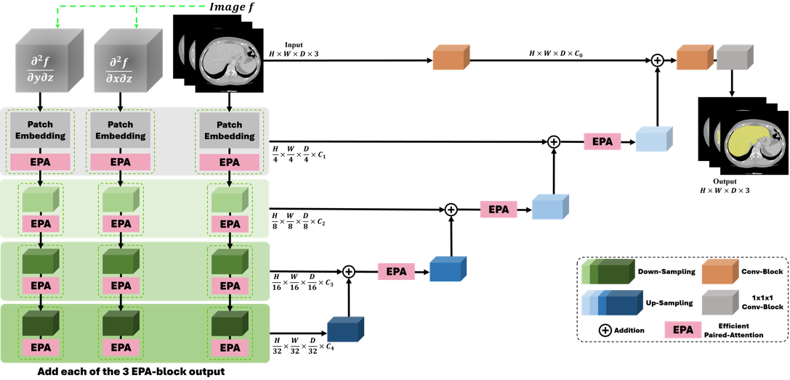

# G-UNETR++: MSD Whole liver segmentation
---
  
  
**🔥G-UNETR++: A gradient-enhanced network for accurate and robust liver segmentation from CT images**   
Paper: [G-UNETR++](#)
  
---
# Requirements
Our code is based on [UNETR++](https://github.com/Amshaker/unetr_plus_plus) code.  
But, we modified the code for easy implementation.
Our GPU is `RTX 3090 GPU`.  
  
## Environment
1. Create and activate conda environment  
```bash
conda create --name gunetr_pp python=3.9
conda activate gunetr_pp
```
  
2. Install pytorch
```bash
# cuda 11.3
conda install pytorch==1.12.0 torchvision==0.13.0 torchaudio==0.12.0 cudatoolkit=11.3 -c pytorch
```
It is important that check your `cuda version`.  
Please, see the [pytorch document](https://pytorch.org/get-started/previous-versions/#v1120).  
  
3. Install other dependencies
```
pip install -r requirements.txt
```
  
---
# Dataset
In paper, we teseted `MSD`.  
  
## Dataset format
```
GUNETR_pplus_LiTS
├── DATASET_Synapse                  
│   ├── unetr_pp_raw
│       ├── unetr_pp_raw_data           
│           ├── Task02_Synapse           
│               ├── Task002_Synapse         
│                   ├── seg_gt
│                       ├── test
│                           ├── hepaticvessel_001.nii.gz
│                           ├── hepaticvessel_004.nii.gz
│                           ├── ...
│                           └── hepaticvessel_455.nii.gz
│                   ├── unetr_pp_Data_plans_v2.1_stage1
│                       ├── test
│                           ├── hepaticvessel_001.nii.gz
│                           ├── hepaticvessel_004.nii.gz
│                           ├── ...
│                           └── hepaticvessel_455.nii.gz
│                   └── unetr_pp_Plansv2.1_plans_3D.pkl
```
MSD dataset: [link](http://medicaldecathlon.com/).
> Our MSD-testset(50) is `1, 4, 9, 10, 11, 13, 15, 21, 27, 44, 50, 52, 53, 62, 66, 69, 71, 75, 82, 89, 91, 92, 101, 116, 117, 124, 136, 140, 147, 171, 179, 183, 213, 215, 229, 245, 265, 269, 275, 287, 305, 307, 359, 375, 377, 399, 425, 441, 445, 455`.  
  
## Model Checkpoint
```
GUNETR_pplus_LiTS
├── output_synapse                 
│   ├── 3d_fullres
│       ├── Task002_Synapse                   
│           ├── unetr_pp_trainer_synapse__unetr_pp_Plansv2.1        
│               ├── fold_4
│                   ├── validation_raw
│                   ├── model_best.model
│                   └── model_best.model.pkl
```
Whole-liver-best chekcpoint: [link](https://drive.google.com/file/d/1f2HWpnDQgyTZMYf810YKldAhw4hEWGKl/view?usp=sharing).  

---
# Implementation
1. Make whole npy files
```bash
$> python MSD_npy_make.py
```
You select the options, `whole`.  
  
2. Evaluation script
```bash
$> cd ./evaluation_scripts
$> sh run_evaluation_synapse.sh
```
You select the options, `whole`.  
  
3. Calculation metrics
Please see our [jupyter notebook](https://github.com/AI-Medical-Vision/GUNETR_pplus_LiTS/blob/main/LiTS_metric.ipynb).  
We implemented all of metric classes.  
> You can control post-processing option through `flag_post = True`.
  
---
# Result
## LiTS
| Model | DSC | Jaccard | VOE | RAVD | ASSD | RMSD | MSSD |  
| --- | --- | --- | --- | --- | --- | --- | --- |  
| Guo et al. | 0.9430 | --- | --- | --- | 2.30 | 4.70 | 34.70 | 
| Song et al. | 0.9680 | --- | 0.0700 | 0.0150 | --- | --- | --- | 
| Lei et al.  | 0.9630 | --- | 0.0688 | 0.0146 | 1.37 | 77.60 | --- | 
| Chen et al. | 0.9650 | --- | 0.0670 | 0.0090 | 1.22 | 28.09 | --- | 
| Zhu et al. | 0.9688 | 0.9422 | 0.0578 | **0.0039** | 1.09 | --- | 16.08 | 
| Chen et al. | 0.9727 | --- | 0.0531 | 1.0800 | 1.31 | 3.05 | --- | 
| **Ours (G-UNTER++)** | **0.9737** | **0.9490** | **0.0511** | 0.0201 | **0.64** | **1.17** | **12.75** | 
  
---
# References
[UNETR++](https://arxiv.org/abs/2212.04497)  
  
---
# Citation
```bibtex
@ARTICLE{
  title={G-UNETR++: A gradient-enhanced network for accurate and robust liver segmentation from CT images}, 
  author={Seungyoo Lee, Kyujin Han, Hangyeul Shin, Harin Park, Xiaopeng Yang, Jae Do Yang, Hee Chul Yu, Heecheon You},
  journal={}, 
  year={2024},
  doi={}}
```
